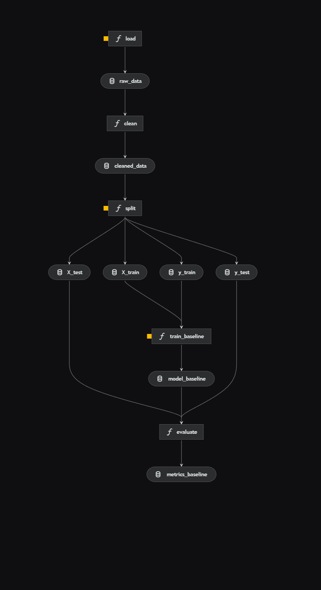

# asi-ml-template

Template repo do projektu

## Zbiór danych

- Link: <https://archive.ics.uci.edu/dataset/2/adult>
- Data pobrania: 03.10.2025r 16:53

### Licencja zbioru danych

This dataset is licensed under a Creative Commons Attribution 4.0 International (CC BY 4.0) license.
This allows for the sharing and adaptation of the datasets for any purpose, provided that the appropriate credit is given.

## Metryka oceny modelu

Jako nasza metryka oceny modelu wybraliśmy **AP** (Average Precision). Decyzja ta jest zmotywowana faktem, że metryka ta znakomicie radzi sobie przy niezbalansowanych zbiorach danych. Dzięki niej będziemy też mogli skupić się na ocenie jakości modelu w przewidywaniu klasy pozytywnej, czyli tego czy dana osoba zarabia >$50k.

Rozważaliśmy również metrykę AUC-ROC, aczkolwiek jak ustaliliśmy, jej wynik może być łatwo zawyżany przez przewagę w ilości wierszy z klasą negatywną (<$50k).

## Wandb

Panel projektu w W&B dostępny jest pod adresem:
<https://wandb.ai/s28044-polish-japanese-academy-of-information-technology/asi-group-15-01?nw=nwusers28044>

## Kedro Quickstart

Cały pipeline (ładowanie danych, preprocessing, podział na zbiory, trening modelu, ewaluacja, logowanie metryk i modelu) uruchamia się poleceniem:

kedro run

Po wykonaniu pipeline dane i model zapisują się lokalnie w strukturze:

- dane surowe: data/01_raw/
- dane po czyszczeniu: data/02_interim/
- dane przygotowane do uczenia modelu: data/03_processed/
- wytrenowany model: data/06_models/model_baseline.pkl
- metryki:data/09_tracking/metrics_baseline.json

## Kedro Pipeline

